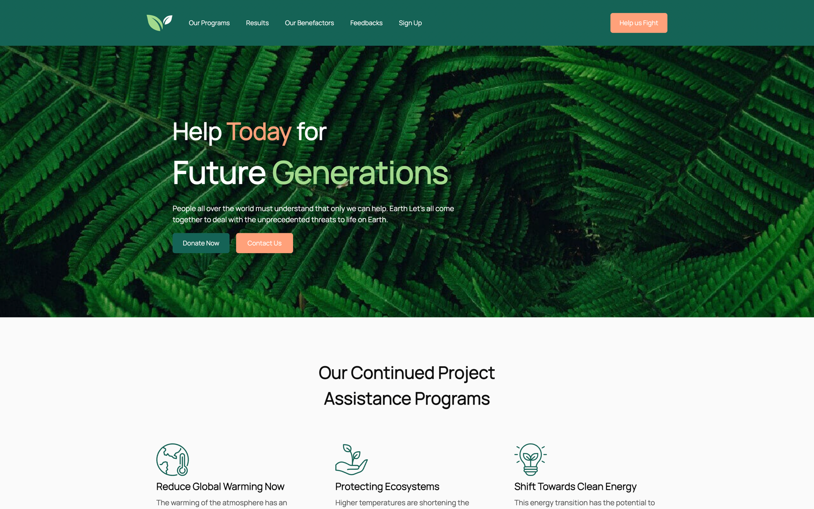

# Save Our Earth Landing Page

Welcome to the Save Our Earth Landing Page! This is a platform dedicated to showcasing and promoting various projects aimed at environmental conservation, sustainability, and making a positive impact on our planet. We believe that by leveraging technology and collaborative efforts, we can work together to create a greener and more sustainable future for generations to come.



## Table of Contents

- [Introduction](#introduction)
- [Features](#features)
- [Getting Started](#getting-started)

## Introduction

This landing page is built using the modern web technologies: React, TypeScript, and Tailwind CSS. These technologies were chosen to provide a seamless, interactive, and visually appealing experience for both project creators and visitors. By harnessing the power of these technologies, we aim to highlight the importance of environmental conservation and encourage collaboration on impactful projects.

## Features

- **Project Showcase:** Browse through an inspiring collection of projects related to environmental sustainability, waste reduction, and more.

- **Project Results:** Get information about our results, what we have already done and what we could do with your help.

- **Contribution Opportunities:** Connect with project creators and explore opportunities to contribute. Whether you're a developer, designer, writer, or just passionate about the cause, you can play a role in these projects.

- **Responsive Design:** Access the landing page seamlessly on various devices, including desktops, tablets, and mobile phones, for a consistent and enjoyable experience.

## Getting Started

To run this project locally, follow these steps:

1. **Clone the repository:** Use the following command to clone the repository to your local machine.

   ```bash
   git clone https://github.com/xmal0x/earth-life-landing.git
   ```

2. **Navigate to the project directory:** Enter the project directory using the following command.

   ```bash
   cd earth-life-landing
   ```

3. **Install dependencies:** Install the necessary dependencies using npm or yarn.

   ```bash
   npm install
   # or
   yarn install
   ```

4. **Start the development server:** Run the development server to see the project in action.

   ```bash
   npm start
   # or
   yarn start
   ```

5. **Access the project:** Open your web browser and go to `http://localhost:3000` to see the Save Our Earth Landing Page.

---
